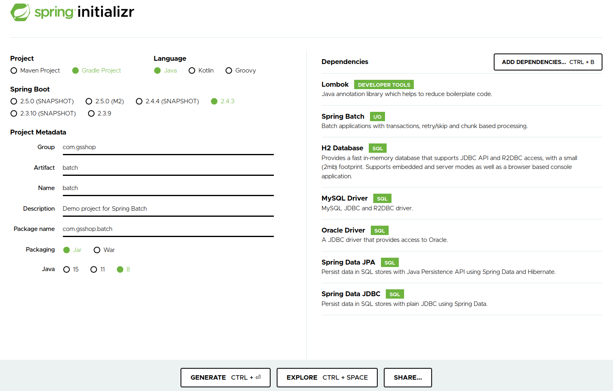
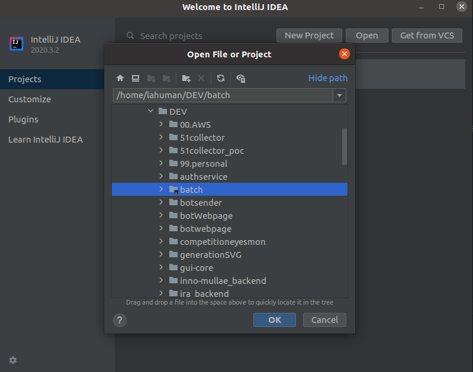

# SpringBatch에서 Mutlti datasource 설정

> 회사내에서 배치 작업을 잠시 하게 되었습니다. 오랜만에 자바를 사용해보는거라 재미있네요. 스프링 설정은 이젠 javaconfig 만으로 웬만한 설정은 다 할수 있습니다.

**추가 정보 : 스프링 배치에 대한 문서는 토리맘님의 한글 라이즈 프로젝트에 한글로 번역된 문서가 있습니다.**
- [Spring Batch Introduction](https://godekdls.github.io/Spring%20Batch/introduction/)

## [spring initializr](https://start.spring.io/)를 활용한 프로젝트 생성
SpringBatch의 초기 프로젝트를 [spring initializr](https://start.spring.io/)에서 생성 합니다.

제가 준 옵션은 아래와 같습니다.



Gradle을 사용하고, Jdk는 1.8을 지정하였습니다.
Mysql은 Spring Batch의 Meta데이터를 저장하는 용도이며, H2 DB는 개발용으로, Oracle는 배치 데이터의 조회 & 적재용으로 사용하게 됩니다.
개발툴은 intellij 기준으로 진행합니다.

## 초기 환경 구성 진행

1. [spring initializr](https://start.spring.io/) 에서 프로젝트 정보를 입력하고 생성 & 다운로드합니다.

2. 다운로드한 파일의 압축을 풉니다.
3. intellij에서 open 을 선택하고 압축 푼 디렉토리를 선택합니다.
   
4. Gradle에서 관련 모듈 다운로드가 완료되기를 기다립니다.

## Spring Batch 설정

> 기본적인 Spring Batch에 대한 내용은 [Spring Batch Introduction](https://godekdls.github.io/Spring%20Batch/introduction/)을 읽어보시기를 권장합니다.


Spring Batch는 Job, Step, 사용자가 개발하는 처리 유닛으로 나누어져 있습니다. 이렇게 구현함으로 다음과 같은 장점을 얻을 수 있습니다.

- 명확한 관심사 분리
- 인터페이스로 제공하는 명확한 아키텍처 레이어와 서비스
- 빠르게 적용하고 쉽게 응용할 수 있는 간단한 디폴트 구현체
- 크게 향상된 확장성

### [Creating a Batch Service](https://spring.io/guides/gs/batch-processing/)를 기준으로 코드를 작성 할 예정입니다.

```src/main/resources/sample-data.cvs```에 아래 내용을 작성하고 저장합니다.

```
Jill,Doe
Joe,Doe
Justin,Doe
Jane,Doe
John,Doe
```

데이터가 적재될 table을 생성하는 스크립트를 ```src/main/resources/schema-all.sql```에 아래 내용을 작성하고 저장합니다.

```sql
DROP TABLE people IF EXISTS;

CREATE TABLE people  (
    person_id BIGINT IDENTITY NOT NULL PRIMARY KEY,
    first_name VARCHAR(20),
    last_name VARCHAR(20)
);
```

> Spring Boot는 ```schema-@@platform@@.sql``` 파일을 시작시 실행합니다. ```-all```은 모든 플랫폼을 의미합니다.

저장 데이터 구조가 되는 ```Person.java```를 생성합니다.

```java
package com.gsshop.batch.work;

public class Person {

    private String lastName;
    private String firstName;

    public Person() {
    }

    public Person(String firstName, String lastName) {
        this.firstName = firstName;
        this.lastName = lastName;
    }

    public void setFirstName(String firstName) {
        this.firstName = firstName;
    }

    public String getFirstName() {
        return firstName;
    }

    public String getLastName() {
        return lastName;
    }

    public void setLastName(String lastName) {
        this.lastName = lastName;
    }

    @Override
    public String toString() {
        return "firstName: " + firstName + ", lastName: " + lastName;
    }

}
```

데이터를 받아서 대문자로 처리 하는 PersonItemProcessor을 생성합니다.

```java
package com.gsshop.batch.work;

import org.slf4j.Logger;
import org.slf4j.LoggerFactory;

import org.springframework.batch.item.ItemProcessor;

public class PersonItemProcessor implements ItemProcessor<Person, Person> {

    private static final Logger log = LoggerFactory.getLogger(PersonItemProcessor.class);

    @Override
    public Person process(final Person person) throws Exception {
        final String firstName = person.getFirstName().toUpperCase();
        final String lastName = person.getLastName().toUpperCase();

        final Person transformedPerson = new Person(firstName, lastName);

        log.info("Converting (" + person + ") into (" + transformedPerson + ")");

        return transformedPerson;
    }

}
```

작업에 대한 처리가 완료 되었을대 확인이 가능한 리스너를 제작합니다.
해당 리스너의 역할은 단순히 작업이 완료 되었을 경우 저장된 데이터를 출력하게 됩니다.

```java
package com.gsshop.batch.work;

import org.slf4j.Logger;
import org.slf4j.LoggerFactory;
import org.springframework.batch.core.BatchStatus;
import org.springframework.batch.core.JobExecution;
import org.springframework.batch.core.listener.JobExecutionListenerSupport;
import org.springframework.beans.factory.annotation.Autowired;
import org.springframework.jdbc.core.JdbcTemplate;
import org.springframework.stereotype.Component;

@Component
public class JobCompletionNotificationListener extends JobExecutionListenerSupport {

    private static final Logger log = LoggerFactory.getLogger(JobCompletionNotificationListener.class);

    private final JdbcTemplate jdbcTemplate;

    @Autowired
    public JobCompletionNotificationListener(JdbcTemplate jdbcTemplate) {
        this.jdbcTemplate = jdbcTemplate;
    }

    @Override
    public void afterJob(JobExecution jobExecution) {
        if(jobExecution.getStatus() == BatchStatus.COMPLETED) {
            log.info("!!! JOB FINISHED! Time to verify the results");

            jdbcTemplate.query("SELECT first_name, last_name FROM people",
                    (rs, row) -> new Person(
                            rs.getString(1),
                            rs.getString(2))
            ).forEach(person -> log.info("Found <" + person + "> in the database."));
        }
    }
}
```


Batch의 시작점인 BatchConfiguration을 작성합니다. 해당 내용에는 reader, processor, writer, 조립 설정 등이 포함 됩니다.

```java
package com.gsshop.batch.work;

import org.springframework.batch.core.Job;
import org.springframework.batch.core.Step;
import org.springframework.batch.core.configuration.annotation.EnableBatchProcessing;
import org.springframework.batch.core.configuration.annotation.JobBuilderFactory;
import org.springframework.batch.core.configuration.annotation.StepBuilderFactory;
import org.springframework.batch.core.launch.support.RunIdIncrementer;
import org.springframework.batch.item.database.BeanPropertyItemSqlParameterSourceProvider;
import org.springframework.batch.item.database.JdbcBatchItemWriter;
import org.springframework.batch.item.database.builder.JdbcBatchItemWriterBuilder;
import org.springframework.batch.item.file.FlatFileItemReader;
import org.springframework.batch.item.file.builder.FlatFileItemReaderBuilder;
import org.springframework.batch.item.file.mapping.BeanWrapperFieldSetMapper;
import org.springframework.beans.factory.annotation.Autowired;
import org.springframework.context.annotation.Bean;
import org.springframework.context.annotation.Configuration;
import org.springframework.core.io.ClassPathResource;

import javax.sql.DataSource;

@Configuration
@EnableBatchProcessing
public class BatchConfiguration {
    @Autowired
    public JobBuilderFactory jobBuilderFactory;
    @Autowired
    public StepBuilderFactory stepBuilderFactory;

    @Bean
    public FlatFileItemReader<Person> reader() {
        return new FlatFileItemReaderBuilder<Person>()
                .name("personItemReader")
                .resource(new ClassPathResource("sample-data.csv"))
                .delimited()
                .names(new String[]{"firstName", "lastName"})
                .fieldSetMapper(new BeanWrapperFieldSetMapper<Person>() {{
                    setTargetType(Person.class);
                }})
                .build();
    }

    @Bean
    public PersonItemProcessor processor() {
        return new PersonItemProcessor();
    }

    @Bean
    public JdbcBatchItemWriter<Person> writer(DataSource dataSource) {
        return new JdbcBatchItemWriterBuilder<Person>()
                .itemSqlParameterSourceProvider(new BeanPropertyItemSqlParameterSourceProvider<>())
                .sql("INSERT INTO people (first_name, last_name) VALUES (:firstName, :lastName)")
                .dataSource(dataSource)
                .build();
    }

    @Bean
    public Job importUserJob(JobCompletionNotificationListener listener, Step step1) {
        return jobBuilderFactory.get("importUserJob")
                .incrementer(new RunIdIncrementer())
                .listener(listener)
                .flow(step1)
                .end()
                .build();
    }

    @Bean
    public Step step1(JdbcBatchItemWriter<Person> writer) {
        return stepBuilderFactory.get("step1")
                .<Person, Person> chunk(10)
                .reader(reader())
                .processor(processor())
                .writer(writer)
                .build();
    }
}
```

여기까지 설정하고 실행하면 잘 동작하는 것을 확인 할 수 있습니다.

## Multi Datasoruce 설정

Multi datasource는 springboot의  multi Datasource를 사용하는 것과 동일합니다.

Datasource 생성을 하는 설정파일을 생성합니다.

```java
package com.gsshop.batch.config;

import com.zaxxer.hikari.HikariDataSource;
import org.springframework.boot.autoconfigure.batch.BatchDataSource;
import org.springframework.boot.context.properties.ConfigurationProperties;
import org.springframework.boot.jdbc.DataSourceBuilder;
import org.springframework.context.annotation.Bean;
import org.springframework.context.annotation.Configuration;
import org.springframework.context.annotation.Primary;
import org.springframework.data.transaction.ChainedTransactionManager;
import org.springframework.jdbc.datasource.DataSourceTransactionManager;
import org.springframework.transaction.PlatformTransactionManager;

import javax.sql.DataSource;

@Configuration
public class DatabaseConfig {
    @Bean
    @Primary
    @ConfigurationProperties("spring.datasource.default")
    DataSource springBatchDb(){
        DataSourceBuilder builder = DataSourceBuilder.create();
        builder.type(HikariDataSource.class);
        return builder.build();
    }

    @Bean
    @BatchDataSource
    @ConfigurationProperties("spring.datasource.work")
    DataSource workDb(){
        DataSourceBuilder builder = DataSourceBuilder.create();
        builder.type(HikariDataSource.class);
        return builder.build();
    }

    // Transaction Setting

    @Bean
    PlatformTransactionManager springBatchTxManager() {
        return new DataSourceTransactionManager(springBatchDb());
    }

    @Bean
    PlatformTransactionManager workTxManager() {
        return new DataSourceTransactionManager(workDb());
    }

    @Bean
    PlatformTransactionManager chainTxManager() {
        ChainedTransactionManager txManager = new ChainedTransactionManager(springBatchTxManager(), workTxManager());
        return txManager;
    }

}
```

- ```@Primary```는 기본으로 DatasSource를 이용할 경우 자동으로 주입되는 DataSource 입니다.
- ```@BatchDataSource``` 는 SpringBatch의 Meta정보를 저장할 때 사용하는 DataSsource 입니다.

특정 DataSource 사용할 경우 ```@Qualifier```를 이용합니다. 다음 예제를 확인하셔요.

```java
@Bean
public JdbcBatchItemWriter<Person> writer(@Qualifier("workDb") DataSource dataSource) {
    return new JdbcBatchItemWriterBuilder<Person>()
            .itemSqlParameterSourceProvider(new BeanPropertyItemSqlParameterSourceProvider<>())
            .sql("INSERT INTO people (first_name, last_name) VALUES (:firstName, :lastName)")
            .dataSource(dataSource)
            .build();
}
```

## 참고자료

- [Spring Batch Introduction](https://godekdls.github.io/Spring%20Batch/introduction/)
- [spring initializr](https://start.spring.io/)
- [Spring Batch 로 다중 Data Source 접근하기(매우 간단 주의)](https://medium.com/official-podo/spring-batch-%EB%A1%9C-%EB%8B%A4%EC%A4%91-data-source-%EC%A0%91%EA%B7%BC%ED%95%98%EA%B8%B0-%EB%A7%A4%EC%9A%B0-%EA%B0%84%EB%8B%A8-%EC%A3%BC%EC%9D%98-7332f2a5f7f8)
- [12. Batch Applications](https://docs.spring.io/spring-boot/docs/current/reference/html/howto.html)
- [Working With Spring Batch and Distributed Transaction](https://medium.com/swlh/working-with-spring-batch-and-distributed-transaction-772de2219e60)
- [Creating a Batch Service](https://spring.io/guides/gs/batch-processing/)