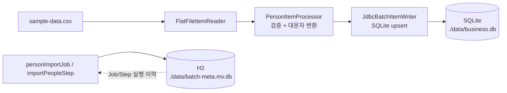

# Spring Batch Multi-Datasource 101

This is a small, production-minded Spring Batch 6 example that keeps Batch
metadata in an H2 file database and business data in a SQLite file database.
It requires no external database installation and demonstrates explicit data
source boundaries, repeatable imports, isolated tests, and an opt-in failure
scenario.

## Quick start

JDK 21 is required. From the project root:

```bash
./gradlew clean test
mkdir -p data
./gradlew bootRun --args='run.id=1,java.lang.Long,true'
```

The Job finishes with `COMPLETED`, creates database files below `./data/`, and
keeps five uppercase people in SQLite.

## 프로젝트 목적

이 저장소는 외부 DB 서버 없이 서로 다른 DBMS를 사용하는 Spring Batch
멀티 데이터소스 구성을 학습하고 검증하기 위한 예제입니다.

- Spring Batch 메타데이터: H2 파일 DB
- 업무 데이터: SQLite 파일 DB
- 입력: classpath의 CSV 5건
- 처리: 이름 유효성 검사 및 `Locale.ROOT` 기준 대문자 변환
- 출력: 재실행에 안전한 SQLite upsert
- 테스트: 매번 임시 디렉터리의 파일 DB 사용

필요한 것은 JDK 21뿐입니다. 별도의 Gradle이나 DBMS를 설치하지 말고
저장소에 포함된 Gradle Wrapper를 사용하세요.

## 처리 구조


```mermaid
flowchart LR
    CSV["sample-data.csv"] --> R["FlatFileItemReader"]
    R --> P["PersonItemProcessor<br/>검증 + 대문자 변환"]
    P --> W["JdbcBatchItemWriter<br/>SQLite upsert"]
    W --> S[("SQLite<br/>./data/business.db")]

    J["personImportJob / importPeopleStep"] --> M[("H2<br/>./data/batch-meta.mv.db")]
    M -. "Job/Step 실행 이력" .-> J
```

JobRepository의 트랜잭션과 업무 쓰기의 트랜잭션은 명시적으로 분리되어
있습니다.

| 역할 | Bean | 데이터베이스 | 트랜잭션 매니저 |
|---|---|---|---|
| Batch 메타데이터 | `batchDataSource` (`@BatchDataSource`) | H2 file | `batchTransactionManager` (`@BatchTransactionManager`) |
| 업무 데이터 | `businessDataSource` (`@Primary`) | SQLite file | `businessTransactionManager` (`@Primary`) |

`importPeopleStep`은 반드시 `businessTransactionManager`를 사용합니다.
Spring Boot의 Batch 자동 구성은 별도로 표시된 H2 데이터소스와 트랜잭션
매니저를 사용해 JobRepository를 구성합니다.

## 실행 시나리오

### 정상 실행

```bash
./gradlew bootRun --args='run.id=1,java.lang.Long,true'
```

로그에서 Job 상태 `COMPLETED`와 업무 데이터 5건을 확인할 수 있습니다.

### 다른 Job 인스턴스로 재실행

```bash
./gradlew bootRun --args='run.id=2,java.lang.Long,true'
```

H2에는 새로운 Job 실행 이력이 추가되지만 SQLite의 업무 데이터는 계속
5건입니다.

### 의도적 실패 데모

```bash
./gradlew bootRun --args='--demo.failure=true run.id=3,java.lang.Long,true'
```

기본값은 `demo.failure=false`입니다. 옵션을 켜면 import가 끝난 뒤
`failureDemoStep`이 `Intentional failure requested by demo.failure` 예외를
발생시키며 Job 상태가 `FAILED`가 됩니다. Spring Boot 애플리케이션 자체는
정상 종료할 수 있으므로 Gradle의 `BUILD SUCCESSFUL`이 아니라 Job 상태
로그를 확인하세요.

## 재실행과 트랜잭션 경계

SQLite writer는 `(first_name, last_name)` 유니크 키에 대해
`INSERT ... ON CONFLICT ... DO UPDATE`를 사용합니다. 따라서 서로 다른
Job 파라미터로 같은 CSV를 여러 번 처리해도 업무 행이 중복되지 않습니다.

이 예제는 두 로컬 DBMS가 하나의 원자적 트랜잭션에 참여한다고 가정하지
않습니다. H2의 Batch 메타데이터 트랜잭션과 SQLite의 chunk 트랜잭션은
독립적입니다. 실제 시스템에서도 재시도 가능한 writer, 멱등 키, 보상 처리
등을 설계해야 하며 이 예제의 upsert가 그 최소 패턴을 보여줍니다.

## 로컬 데이터 초기화

애플리케이션이 종료된 상태에서 프로젝트의 `./data/` 바로 아래 파일만
삭제합니다.

```bash
find ./data -mindepth 1 -maxdepth 1 -type f -delete
```

`data/`는 Git에서 제외됩니다. 테스트는 이 디렉터리를 사용하지 않고 OS의
임시 디렉터리에 각각 H2와 SQLite 파일을 생성합니다.

## 2021 코드에서 현재 구조로의 변화

| 항목 | 기존 | 현재 |
|---|---|---|
| Java | 8 | 21 |
| Spring Boot | 2.4.x | 4.1.0 |
| Spring Batch | 4.x | 6.0.4 |
| Spring Framework | 5.x | 7.0.8 |
| Gradle Wrapper | 6.8.2 | 9.6.1 |
| 도메인 모델 | mutable JavaBean | immutable `record` |
| Builder 구성 | `JobBuilderFactory` / `StepBuilderFactory` | `JobRepository` 기반 Builder |
| Item API | `org.springframework.batch.item` | `org.springframework.batch.infrastructure.item` |
| 업무 저장소 | 외부 DB 접속 정보 | 로컬 SQLite 파일 |
| Batch 저장소 | 외부 DB | 로컬 H2 파일 |
| 반복 실행 | 중복 가능 | 유니크 키 기반 upsert |
| 실패 예제 | ExitStatus 수동 변경 | 명시적 예외와 실제 `FAILED` 상태 |

의존성 잠금 파일 `gradle.lockfile`도 함께 관리하여 같은 소스에서 재현 가능한
버전을 사용합니다.

## 문제 해결

### Java 또는 class file 버전 오류

```bash
java -version
./gradlew --version
```

두 명령 모두 Java 21을 가리켜야 합니다. 시스템 Gradle 대신 반드시
`./gradlew`를 사용하세요.

### Database is already in use / locked

실행 중인 애플리케이션이나 IDE 프로세스를 먼저 종료한 뒤 다시 실행하세요.
H2와 SQLite는 파일 DB이므로 다른 프로세스가 같은 파일을 열고 있으면 잠금
오류가 날 수 있습니다.

### Windows 경로와 명령

PowerShell에서는 `./gradlew` 대신 `.\gradlew.bat`를 사용할 수 있습니다.
설정 파일의 JDBC URL에는 역슬래시보다 `/`를 권장합니다. 초기화는
애플리케이션 종료 후 다음처럼 프로젝트의 `data` 내용만 삭제하세요.

```powershell
Remove-Item -Path .\data\* -File
```

## 보안

현재 소스 트리에는 외부 DB 주소나 비밀번호를 포함하지 않습니다. 다만
Git에서 파일을 수정하거나 삭제하는 것만으로 과거 커밋의 자격 증명이
사라지지는 않습니다. 이 저장소가 실제 자격 증명을 공개한 적이 있다면 해당
계정을 즉시 폐기하거나 비밀번호를 교체하고, 필요 시 별도의 승인 절차로
Git 이력을 정리해야 합니다.

새로운 비밀값이나 개인 PC의 절대 DB 경로를 커밋하지 마세요.

## 참고 문서

- [Spring Boot Reference Documentation](https://docs.spring.io/spring-boot/)
- [Spring Batch Reference Documentation](https://docs.spring.io/spring-batch/reference/)
- [Gradle User Manual](https://docs.gradle.org/current/userguide/userguide.html)
- [H2 Database Documentation](https://h2database.com/html/main.html)
- [Xerial SQLite JDBC](https://github.com/xerial/sqlite-jdbc)

기여 방법은 [CONTRIBUTING.md](CONTRIBUTING.md)를 참고하세요.
