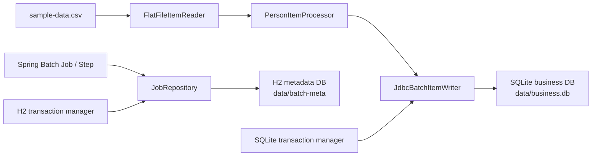

# Spring Batch Multi-DataSource Modernization Design

## 1. Purpose

This project will become a current, runnable reference implementation for using
two heterogeneous JDBC data sources with Spring Batch:

- H2 stores Spring Batch metadata.
- SQLite stores business data.

The example must run without installing a database server. Local executions
persist both databases under `./data/`, while automated tests use isolated
temporary directories.

The primary documentation language is Korean. The README begins with a concise
English summary and quick-start commands so international readers can identify
and run the example.

## 2. Baseline and Motivation

The current project uses Spring Boot 2.4.3, Spring Batch 4-era builder
factories, Java 8, and Gradle 6.8.2. The baseline build cannot start on the
workspace's JDK 21 because Gradle 6.8.2 does not support that runtime. The
project also contains:

- hard-coded remote database connection details and credentials;
- unused JPA, Lombok, Oracle, and MySQL dependencies;
- the deprecated `ChainedTransactionManager`;
- an always-failing default job;
- only a context-loading test;
- documentation and configuration that no longer match current Spring APIs.

The modernization is a direct migration to the current generation rather than
a staged Spring Boot 3 intermediate version. The codebase is small enough that
a staged migration would create disposable intermediate code without reducing
the final design risk.

## 3. Technology Baseline

- Java 21
- Spring Boot 4.1.0
- Spring Batch 6.0.4, managed by the Spring Boot BOM
- Gradle 9.6.1
- H2, with its version managed by the Spring Boot BOM
- Xerial SQLite JDBC 3.53.2.0, pinned explicitly because it is outside the
  Spring Boot BOM
- JUnit and Spring Batch test support supplied by Spring Boot

The build uses the Spring Boot BOM as the source of truth. It does not override
Spring Framework, Spring Batch, H2, logging, or test-library versions. Only
dependencies outside that BOM receive explicit versions.

Unneeded JPA, Lombok, Oracle, and MySQL dependencies are removed. The project
keeps only the Batch and JDBC facilities required by the example.

## 4. Architecture



### 4.1 Configuration boundaries

`BatchInfrastructureConfiguration` owns:

- the H2 batch metadata `DataSource`;
- the batch metadata `PlatformTransactionManager`;
- the JDBC-backed Spring Batch repository and infrastructure;
- initialization of the official H2 Spring Batch metadata schema.

`BusinessDataSourceConfiguration` owns:

- the SQLite business `DataSource`;
- the business `JdbcTemplate`;
- the SQLite `PlatformTransactionManager`;
- idempotent initialization of the `people` table.

`PersonImportJobConfiguration` owns:

- the CSV reader;
- the person processor;
- the SQLite writer;
- the import step;
- the optional failure demonstration step;
- the job flow.

The job configuration depends on qualified infrastructure beans. It does not
create or discover a default `DataSource` implicitly.

Application properties use explicit namespaces:

```text
app.datasource.batch.*
app.datasource.business.*
demo.failure
```

This avoids ambiguous binding and makes the role of each database visible to a
reader.

### 4.2 Domain model and schema

`Person` is a Java 21 record containing `firstName` and `lastName`.

The SQLite `people` table has:

- an integer primary key;
- non-null first and last names;
- a composite unique constraint on `(first_name, last_name)`.

The writer uses SQLite upsert semantics. Re-running the same input therefore
keeps five business rows while H2 retains a separate execution history.

The schema initializer uses `CREATE TABLE IF NOT EXISTS`. It never drops local
business data during ordinary application startup.

## 5. Transaction Model

Spring Batch metadata and business writes use different local transaction
managers:

- H2 transaction manager: Job repository metadata.
- SQLite transaction manager: Chunk-oriented business writes.

The design does not use XA, `ChainedTransactionManager`, or pretend that the
two databases participate in one atomic transaction. This limitation is
documented explicitly.

Restart safety is obtained through:

- Spring Batch execution metadata in H2;
- deterministic CSV processing;
- the SQLite unique constraint;
- idempotent SQLite upsert behavior.

This is a deliberate educational trade-off: the example clearly shows
resource-specific transaction boundaries and a practical idempotency strategy
without introducing a distributed transaction coordinator.

## 6. Runtime Data Policy

Local execution stores files below the project directory:

```text
data/
├── batch-meta.mv.db
└── business.db
```

The exact H2-generated auxiliary filenames may vary, but all runtime database
files remain below `data/`. That directory is ignored by Git.

Tests override both JDBC URLs to use a unique JUnit temporary directory. Tests
must not read, mutate, or depend on the developer's `./data/` directory.

Documentation provides commands for:

- a normal run;
- the failure demonstration;
- a repeated run;
- inspecting observable results;
- clearing local demo data.

Clearing data is an explicit user action and is never part of normal startup.

## 7. Job Flow

### 7.1 Normal flow

1. Create the configured data directory if necessary.
2. Initialize the H2 Spring Batch schema.
3. Initialize the SQLite business schema.
4. Read `sample-data.csv`.
5. Validate and normalize each person using `Locale.ROOT`.
6. Write a chunk to SQLite using the business transaction manager.
7. Record Job and Step state in H2.
8. Log the final Batch status and SQLite row count.

The default value of `demo.failure` is `false`, so a first-time user sees a
successful job.

### 7.2 Failure demonstration

When `demo.failure=true`, the import step is followed by a tasklet that throws
an intentional, clearly named exception. The Job ends with `FAILED`, and logs
identify that the failure was requested by the demo option.

The same imported people remain idempotent on another execution. The H2
metadata shows each completed or failed execution separately.

### 7.3 Input and startup failures

- Blank or missing name fields fail the job with a message identifying the
  invalid record.
- Records are not silently skipped.
- Locale-independent uppercasing uses `Locale.ROOT`.
- An unwritable database directory fails application startup with the
  underlying path and cause visible in the exception chain.
- Schema initialization errors fail startup rather than allowing a partially
  configured application to run.

## 8. Test Design

All integration tests use H2 and SQLite files in a temporary directory.

### 8.1 Unit tests

`PersonItemProcessorTest` verifies:

- uppercase conversion;
- locale-independent behavior;
- rejection of blank or missing names.

### 8.2 Integration tests

`PersonImportJobTest` verifies:

- the Job finishes with `COMPLETED`;
- five normalized people are present in SQLite;
- expected Batch metadata exists in H2.

`FailureDemoJobTest` verifies:

- enabling `demo.failure` produces `FAILED`;
- the recorded failure identifies the intentional demo exception;
- the import result remains queryable in SQLite.

`DataSourceIsolationTest` verifies:

- Spring Batch metadata tables exist only in H2;
- `people` exists only in SQLite;
- qualified JDBC operations target the intended database.

`JobRestartTest` verifies:

- repeated executions do not duplicate `people`;
- H2 retains the additional execution history;
- normal execution remains successful after a demonstrated failure.

`ApplicationContextTest` verifies:

- the application starts with default bean wiring;
- both data sources and transaction managers are unambiguous.

## 9. Documentation Design

The README is reorganized around a runnable learning path:

1. English summary and three-step quick start.
2. Korean project purpose and prerequisites.
3. Architecture and data flow diagram.
4. H2 and SQLite bean and transaction boundaries.
5. Normal execution.
6. Failure and restart demonstration.
7. Result inspection and local data reset.
8. Migration table from Spring Boot 2.4 / Spring Batch 4.
9. Explanation of why `ChainedTransactionManager` is not used.
10. Troubleshooting for Windows, macOS, and Linux paths.
11. Security and dependency maintenance notes.

`CONTRIBUTING.md` documents:

- the Java requirement;
- build and test commands;
- code and test expectations;
- pull-request checks.

Old screenshots may be retained only if they still teach something current.
Outdated Initializr and IDE instructions are replaced with text and Mermaid
diagrams that are easier to maintain.

No license is added without an explicit repository-owner choice. The final
handoff recommends selecting one if the project is intended for reuse.

## 10. Security and Maintenance

- Remove all hard-coded remote endpoints, usernames, and passwords.
- Treat the previously committed password as compromised. Removing it from the
  current tree does not remove it from Git history; its owner must revoke or
  rotate it.
- Keep the dependency graph minimal.
- Use the Spring Boot BOM for coherent dependency upgrades.
- Enable Gradle dependency locking and commit the generated lock state.
- Add GitHub Actions checks for JDK 21 build and test execution.
- Add Gradle Wrapper validation to CI.
- Add weekly Dependabot updates for Gradle and GitHub Actions.
- Inspect the resolved runtime and test dependency graphs after migration and
  record the vulnerability-check result in the implementation handoff.

History rewriting is outside this implementation scope because it is
destructive and requires repository-owner coordination.

## 11. Success Criteria

The modernization is complete when:

- `./gradlew clean test` succeeds on Java 21.
- A normal run succeeds without any installed database server.
- Local H2 and SQLite files are created only below `./data/`.
- The failure option produces a deliberate `FAILED` execution.
- Re-running the input leaves exactly five unique business records.
- Batch tables and business tables are isolated in their intended databases.
- No remote database credential or endpoint remains in the working tree.
- Direct dependencies are minimal, current, and documented.
- CI, Wrapper validation, dependency locking, and Dependabot configuration are
  present.
- README and contribution documentation match the verified commands.

## 12. Authoritative References

- [Spring Boot 4.1 system requirements](https://docs.spring.io/spring-boot/system-requirements.html)
- [Spring Boot managed dependency coordinates](https://docs.spring.io/spring-boot/appendix/dependency-versions/coordinates.html)
- [Spring Batch 6 reference](https://docs.spring.io/spring-batch/reference/)
- [Spring Batch 6 changes](https://docs.spring.io/spring-batch/reference/whatsnew.html)
- [Gradle Java compatibility](https://docs.gradle.org/current/userguide/compatibility.html)
- [Xerial SQLite JDBC](https://github.com/xerial/sqlite-jdbc)
